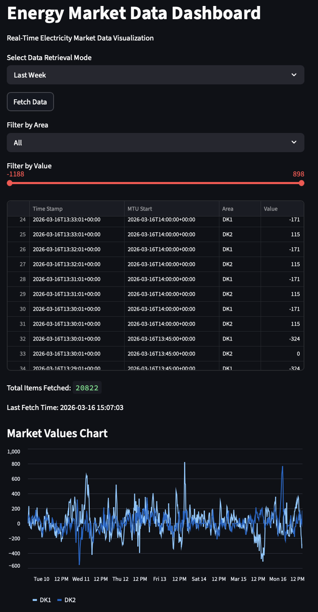

# Energy Market Data Pipeline

Small Python project for fetching and exploring Energinet public electricity market data.

It includes:
- A client for calling the API
- A parser that normalizes the payload
- A service layer used by both UI and cloud function
- A Streamlit dashboard for quick exploration
- Tests for core behavior

## Context

This project was developed as part of a technical assignment focused on building a small data pipeline and dashboard around the Energinet public electricity market dataset. The goal was to demonstrate API integration, data normalization, error handling, and basic visualization using Python.

## What It Does
The app fetches data from Energinet's public dataset endpoint (`mfrrRequest`) using one of three modes:
- `latest`
- `lastweek`
- `period` (custom start/end)

Returned JSON is validated and transformed into a flat list with these fields:
- `Time Stamp`
- `MTU Start`
- `Area`
- `Value`

## Project Layout
```bash
energy_market_pipeline
|_ app/
|    |_  client.py        # API requests, endpoint building, datetime normalization
|    |_  parser.py        # Payload validation and flattening
|    |_  service.py       # Mode routing + parser orchestration
|    |_  config.py        # Constants and environment settings
|    |_  exceptions.py    # Custom exception types
|    |_  logger.py        # Logging setup
|
|_ cloud_function/
|    |_  main.py          # Serverless handler entrypoint
|
|_ tests/             # Tests
|    |_  test_client.py
|    |_  test_parser.py
|    |_  test_service.py
|
|_ streamlit_app.py   # Streamlit dashboard
```

## Architecture Overview

The project separates responsibilities into small modules:

- **client.py** handles API communication and request validation
- **parser.py** validates and normalizes the API payload
- **service.py** routes the different retrieval modes and orchestrates the client + parser
- **streamlit_app.py** provides a simple dashboard for exploring the processed data
- **cloud_function/main.py** exposes the same service logic as a serverless handler

Both the Streamlit dashboard and the cloud function reuse the same service layer.

## Setup
Install dependencies:

```bash
pip install -r requirements.txt
```

Optional `.env` example:

```bash
API_TIMEOUT=10
SCHEDULE_INTERVAL=1
```

Notes:
- `API_TIMEOUT` controls request timeout in seconds.
- `SCHEDULE_INTERVAL` must be one of: `1`, `5`, `15`.

## Run The Dashboard
```bash
streamlit run streamlit_app.py
```

Open:

`http://localhost:8501`

## Run Tests
```bash
pytest
```

### Dashboard example



## Cloud Function
`cloud_function/main.py` exposes a `handler(request)` that currently fetches `latest` data via the same service layer.

This is designed to be triggered by an external scheduler. If you use scheduling logic based on `SCHEDULE_INTERVAL`, allowed values are 1, 5, or 15 minutes.

## Error Handling
The request/client layer handles common API failures:
- Timeouts
- Connection failures
- HTTP errors
- Invalid JSON responses

Main custom exceptions:
- `ApiRequestError`
- `InvalidApiResponseError`

The parser also skips malformed entries in the payload instead of failing the full response.

## Data Source
Energinet Public Data API:

https://electricitymarketservice.energinet.dk